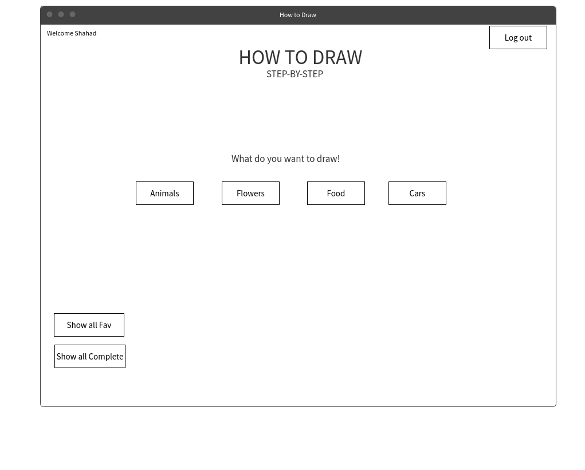
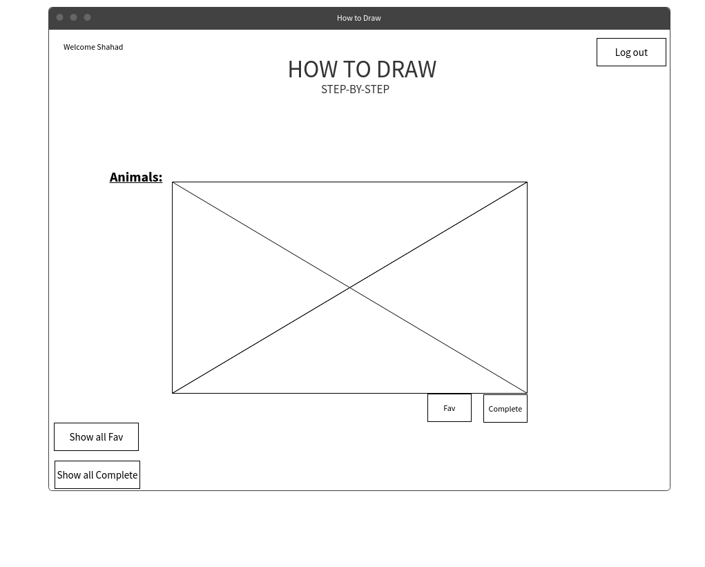
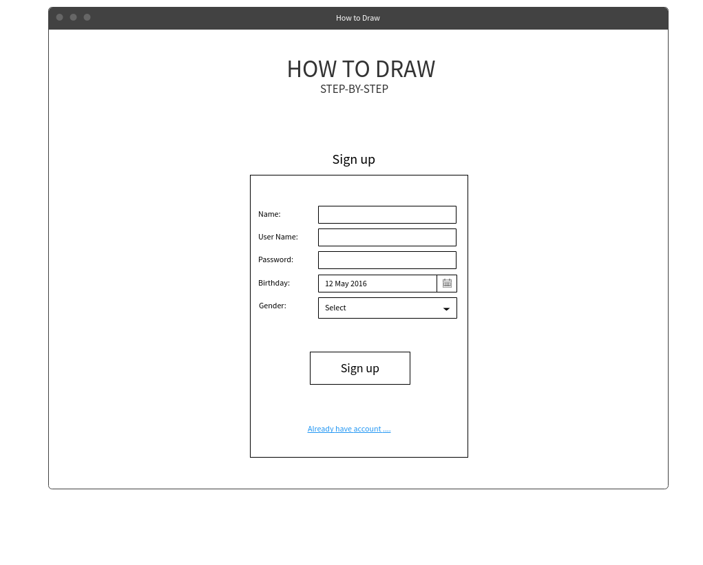

### How To Draw 
### Step by Step for Kids

### Descriprtion :
It is a Full-Stack MERN web application that allow user to have an account and teach the kids how to draw step by step.

### User Stories :
1- As a user, I can register so that I can access my account.
2- As a user, I can log in so that I can show draws.
3- As a user, I can log out from my account.
4- As a user, I can show different draws so that I can draw.
5- As a user, I can add draw to my favorite so that I can draw it later.
6- As a user I can mark a draw as complete so that I know I already draw it.
7- As a user I can show all draws that I add it to favorite.
8- As a user I can show all draws that I add it to complete.

#### The Wireframe :

### Tools :
1- ReactJS
2- Express
3- MongoDB

### Future Work :
- Edit the CSS.
- Add more draw images and add it to DB.
- Let the user draw in the website.